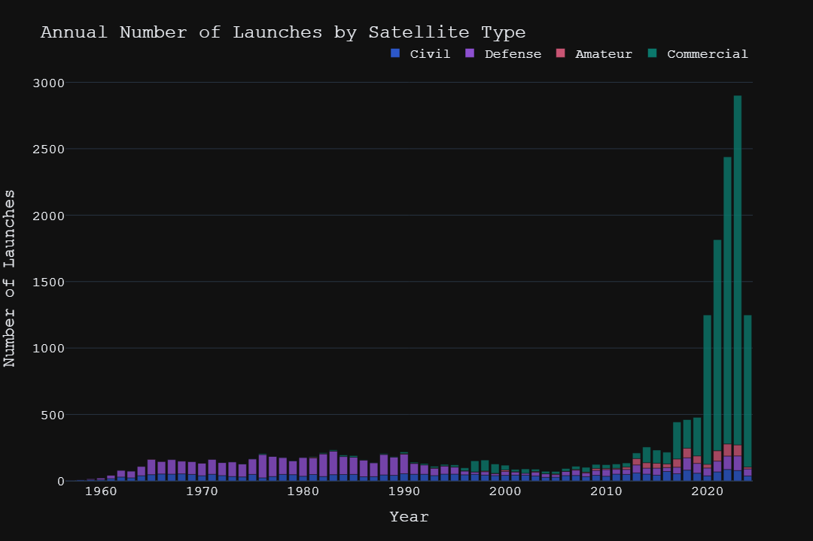

# ASO EDA: Tracked Artificial Space Objects Analysis & Status Prediction

### Table Of Contents

- [ASO EDA: Tracked Artificial Space Objects Analysis \& Status Prediction](#aso-eda-tracked-artificial-space-objects-analysis--status-prediction)
  - [Table Of Contents](#table-of-contents)
  - [Overview](#overview)
  - [Project Proposal / Research Question](#project-proposal--research-question)
  - [Source of Data](#source-of-data)
  - [Data Cleaning and Transformation](#data-cleaning-and-transformation)
  - [Contextual Visualization(s)](#contextual-visualizations)
    - [Visualization](#visualization)
  - [Key Insights](#key-insights)
  - [Future Studies](#future-studies)
    - [Trends in Space Launches:](#trends-in-space-launches)
    - [Technological Advancements:](#technological-advancements)
    - [Orbital Dynamics:](#orbital-dynamics)
    - [Space Debris:](#space-debris)
    - [Mission Lifetimes:](#mission-lifetimes)
  - [Model Training and Prediction](#model-training-and-prediction)
  - [Streamlit Application](#streamlit-application)
  - [How to Run](#how-to-run)
  - [Citations](#citations)

## Overview

This project involves exploratory data analysis (EDA) on tracked artificial space objects (ASOs) to uncover patterns, trends, and insights. It also includes training a machine learning model to predict the status of satellites based on their characteristics.

## Project Proposal / Research Question

- **Research Question:** What are the trends and patterns in the launch and distribution of artificial space objects over time?
- **Objectives:**
  - Analyze the distribution of ASOs by country and organization.
  - Identify temporal trends in ASO launches.
  - Predict the status of satellites using machine learning techniques.

## Source of Data

The primary data sources for this project are:

- [Celestrak](https://www.celestrak.com/)
  - Data Download:
  - [Raw SATCAT Data](https://celestrak.org/pub/satcat.csv)
    - [Documentation](https://celestrak.org/satcat/satcat-format.php)
- [GCAT (J. McDowell)](https://www.planet4589.org/space/gcat/)
  - Data Downloads:
    - [currentcat](https://planet4589.org/space/gcat/tsv/derived/currentcat.tsv)
    - [launch](https://planet4589.org/space/gcat/tsv/launch/launch.tsv)
    - [orgs](https://planet4589.org/space/gcat/tsv/tables/orgs.tsv)
    - [psatcat](https://planet4589.org/space/gcat/tsv/cat/psatcat.tsv)
    - [satcat](https://planet4589.org/space/gcat/tsv/cat/satcat.tsv)
  - [Documentation](https://planet4589.org/space/gcat/web/cat/index.html)
    - Note: Documentation for GCAT is partitioned based on category of data.
  - There are many more sources of useful data available through GCAT than what was used for this analysis.

## Data Cleaning and Transformation

To ensure the reproducibility of results, the following steps were taken:

1. **Data Collection:** Raw data was collected from the sources mentioned above.
2. **Data Cleaning:**
   - Parsed all data into .csv format.
     - Data from GCAT required dropping a line where the author had inserted a comment.
   - Removed duplicate entries.
   - Filled or removed missing values where applicable.
   - Ensured all columns contained only one data type.
   - Standardized date and time formats.
3. **Data Transformation:**
   - Extracted relevant features such as launch date, country, and object type.
   - Created new columns for derived metrics such as launch year and count.

## Contextual Visualization(s)

To understand the distribution and trends of ASOs, the following visualizations are included:

- Temporal trends in ASO launches.
- Annual number of ASO launches by country.
- Starlink satellites vs all other satellites.
- Satellite types launched over time.

### Visualization

[](https://donnafarris-aso-eda.streamlit.app/#launch_decay_orbit_over_time)

[](https://donnafarris-aso-eda.streamlit.app/#annual_launches_by_country)

[](https://donnafarris-aso-eda.streamlit.app/#launch_count_by_sat_class)

[](https://donnafarris-aso-eda.streamlit.app/#starlink_vs_other_launches)

## Key Insights

- The majority of ASOs are launched by a few key countries, primarily the US, Russia, and China.
- China has been ramping up their launch numbers in recent years.
- There is a notable increase in the number of launches in recent years, driven by commercial satellite deployments.
- Over half of the satellites launched since 2019 are Starlink satellites.

## Future Studies

### Trends in Space Launches:

Analysis of launch dates, types of objects launched, and the countries responsible for launches can reveal trends over time, such as increases in satellite launches for communication or Earth observation.

### Technological Advancements:

Examining changes in the construction, mass, and dimensions of space objects can provide insights into technological advancements and innovations in spacecraft design.

### Orbital Dynamics:

Analysis of canonical orbits and other orbital parameters can shed light on the preferred orbits for different types of missions and the evolution of orbital mechanics over time.

### Space Debris:

Evaluating the number and characteristics of pieces (debris) can contribute to understanding the growing issue of space debris and its management.

### Mission Lifetimes:

Analyzing the lifetimes and end-of-mission statuses can help assess the longevity and success rates of different types of space missions.

## Model Training and Prediction

A Random Forest classifier was trained to predict the status of satellites using various features such as total mass, span, orbital parameters, and object type. The model was tuned using GridSearchCV for optimal performance.

## Streamlit Application

A Streamlit application was developed to provide interactive visualizations of the dataset and to allow users to input satellite parameters and get status predictions.

## How to Run

1. **Start the FastAPI server:**

   ```sh
   uvicorn api:app --reload
   ```

2. **Start the Streamlit application:**

   ```sh
   streamlit run app.py
   ```

3. **Navigate to the Streamlit application in your web browser:**

   ```sh
   http://localhost:8501
   ```

4. **Use the Prediction Form to input satellite parameters and get status predictions.**

## Citations

McDowell, Jonathan C., 2020. General Catalog of Artificial Space Objects, Release 1.5.5 , https://planet4589.org/space/gcat

CelesTrak. (n.d.). Satellite Catalog (SATCAT), https://celestrak.org/pub/satcat.csv
