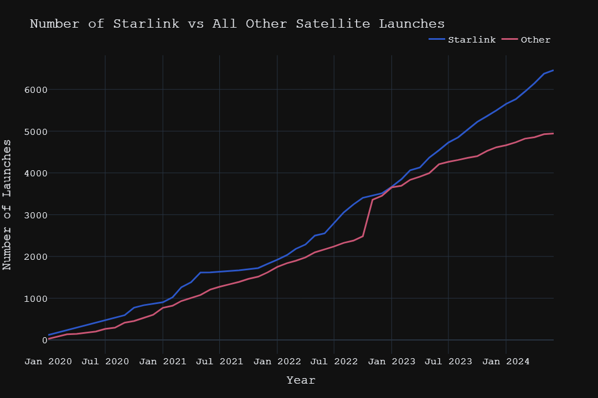

# Tracked Artificial Space Objects Analysis & Status Prediction

### Table of Contents

- [Tracked Artificial Space Objects Analysis \& Status Prediction](#tracked-artificial-space-objects-analysis--status-prediction)
  - [Table of Contents](#table-of-contents)
  - [Introduction](#introduction)
  - [Project Proposal / Research Questions](#project-proposal--research-questions)
    - [Research Questions](#research-questions)
    - [Objectives](#objectives)
  - [Potential Applications of Findings](#potential-applications-of-findings)
  - [Source of Data](#source-of-data)
    - [Celestrak](#celestrak)
    - [GCAT (J. McDowell)](#gcat-j-mcdowell)
  - [Data Integration Challenges and Solutions](#data-integration-challenges-and-solutions)
  - [Exploratory Data Analysis (EDA)](#exploratory-data-analysis-eda)
    - [Feature Categories](#feature-categories)
  - [Key Insights](#key-insights)
  - [Hypothesis Testing](#hypothesis-testing)
    - [Hypothesis Test Approach and Methodology](#hypothesis-test-approach-and-methodology)
    - [Null \& Alternate Hypotheses](#null--alternate-hypotheses)
    - [Chosen Test and Methodology](#chosen-test-and-methodology)
      - [Chi-Square Test](#chi-square-test)
      - [ANOVA (Analysis of Variance)](#anova-analysis-of-variance)
    - [Significance Level](#significance-level)
    - [Power and Sample Size](#power-and-sample-size)
    - [Results and Interpretation](#results-and-interpretation)
  - [Model Selection](#model-selection)
    - [Chosen Model](#chosen-model)
      - [Specifications](#specifications)
    - [Model Assessment](#model-assessment)
    - [Results and Interpretation](#results-and-interpretation-1)
  - [Streamlit Application](#streamlit-application)
    - [Access the App](#access-the-app)
  - [Future Studies](#future-studies)
    - [Trends in Space Launches](#trends-in-space-launches)
    - [Technological Advancements](#technological-advancements)
    - [Orbital Dynamics](#orbital-dynamics)
    - [Space Debris](#space-debris)
    - [Mission Lifetimes](#mission-lifetimes)
  - [Citations](#citations)

## Introduction

Analyzing and predicting the status of artificial space objects (ASOs) is crucial for space traffic management and collision avoidance. This project involves exploratory data analysis (EDA) on tracked ASOs to uncover patterns and trends and develops a machine learning model to predict their status based on various characteristics.

## Project Proposal / Research Questions

### Research Questions

1. **What are the trends and patterns in the launch and distribution of artificial space objects (ASOs) over time?**
   - Analysis of historical data to identify temporal trends and patterns in ASO launches.
   - Examination of the distribution of ASOs by country and organization.
2. **Can orbital parameters, physical characteristics, and object type be used to predict a satellite’s status?**
   - Investigation of the relationship between a satellite's characteristics and its status.
   - Prediction of a satellite’s status using machine learning techniques based on these characteristics.

### Objectives

- **Analyze the distribution of ASOs by country and organization:**
  - Identify the primary contributors to ASO launches and how this has evolved over time.
  - Understand the geopolitical and commercial landscape of space object launches.
- **Identify temporal trends in ASO launches:**
  - Examine the frequency and nature of launches over different periods.
  - Highlight significant changes and potential causes (e.g., new technologies, policies).
- **Predict the status of satellites:**
  - Utilize machine learning to predict the current status of satellites based on their characteristics.
  - Satellite statuses can include categories such as in orbit, decayed, re-entered, landed, etc., as defined in the [GCAT Phases](https://planet4589.org/space/gcat/web/intro/phases.html).
- **Analyze the impact of orbital parameters, physical characteristics, and type on satellite status:**
  - Determine how factors like orbital period, perigee, apogee, inclination, mass, and object type influence the likelihood of different statuses.
- **Develop and validate a predictive model:**
  - Create a robust machine learning model to classify satellite statuses.
  - Validate the model to ensure accuracy and reliability in predictions.

## Potential Applications of Findings

- **Collision Avoidance Systems:**
  - Enhance space traffic management systems by predicting potential hazards from decommissioned satellites and space debris.
- **Satellite Deployment Strategies:**
  - Inform future satellite design and deployment strategies to improve longevity and reduce the likelihood of becoming debris.
- **Policy and Regulation:**
  - Aid in the formulation of policies and regulations for space operations, ensuring sustainable use of outer space.
- **Commercial and Defense Sectors:**
  - Provide insights for commercial satellite operators and defense organizations to optimize their satellite fleets and mission planning.

## Source of Data

The primary data sources for this project are:

### [Celestrak](https://www.celestrak.com/)

- **[Raw SATCAT Data](https://celestrak.org/pub/satcat.csv):**
  - **Description:** Contains data on all tracked artificial satellites, including their identification, launch details, and orbital parameters.
  - **Relevance:** Provides comprehensive information on satellite launches and their current status, crucial for analyzing trends and patterns.

### [GCAT (J. McDowell)](https://www.planet4589.org/space/gcat/)

- **[currentcat](https://planet4589.org/space/gcat/tsv/derived/currentcat.tsv):**
  - **Description:** Summary catalog of the most recent phase for each satellite object, with the latest orbit data.
  - **Relevance:** Offers up-to-date information on the status and orbital characteristics of artificial space objects.
- **[launch](https://planet4589.org/space/gcat/tsv/launch/launch.tsv):**
  - **Description:** Detailed records of launch events, including dates, vehicles, and launch sites.
  - **Relevance:** Essential for analyzing temporal trends in space launches and understanding the historical context of satellite deployment.
- **[orgs](https://planet4589.org/space/gcat/tsv/tables/orgs.tsv):**
  - **Description:** Information on organizations involved in satellite launches and operations.
  - **Relevance:** Helps identify the main contributors to satellite launches and their evolution over time.
- **[psatcat](https://planet4589.org/space/gcat/tsv/cat/psatcat.tsv):**
  - **Description:** Data on payloads, including their identification and orbital details.
  - **Relevance:** Important for distinguishing between different types of space objects and their specific roles in missions.
- **[satcat](https://planet4589.org/space/gcat/tsv/cat/satcat.tsv):**
  - **Description:** Standard catalog of satellites, detailing their identification, launch information, and status.
  - **Relevance:** Provides foundational data for analyzing the overall population of artificial space objects.

## Data Integration Challenges and Solutions

- **Data Integration Challenges:**
  - Integrating data from multiple sources with different formats and standards.
  - Handling missing or inconsistent data entries.
  - Ensuring accurate matching and merging of records across datasets.
- **Solutions:**
  - Standardized all columns to a common format, ensuring consistency in data types and units.
  - Used data cleaning techniques to fill or remove missing values appropriately.
  - Applied robust matching algorithms to merge datasets accurately, preserving the integrity of the information.

These comprehensive datasets, when cleaned and integrated, provide a robust foundation for analyzing trends and predicting the status of artificial space objects.

## Exploratory Data Analysis (EDA)

### Feature Categories

- **Origin Characteristics:**
  - Country, organization, launch date.
- **Orbital Parameters:**
  - Period, perigee, apogee, inclination.
- **Physical Characteristics:**
  - Mass, span, object type.


## Key Insights

- Majority of ASOs are launched by the US, Russia, and China.
- Significant increase in launches due to commercial satellites.
- Over half of the satellites launched since 2019 are Starlink satellites.




## Hypothesis Testing

### Hypothesis Test Approach and Methodology

To rigorously evaluate the relationships between satellite characteristics and their statuses, we performed a series of hypothesis tests. Our approach is clearly defined below:

### Null & Alternate Hypotheses

- **Null Hypothesis (H0):** There is no significant relationship between the satellite characteristics (mass, span, period, perigee, apogee, inclination, object type) and their status.
- **Alternate Hypothesis (H1):** There is a significant relationship between the satellite characteristics and their status.

### Chosen Test and Methodology

#### Chi-Square Test

The Chi-Square test assesses whether there is a significant association between two categorical variables. In this case, we want to determine if the `status` of an object is related to its `object_type`.

#### ANOVA (Analysis of Variance)

ANOVA compares the means of a numerical variable across multiple groups. It helps determine if the average values of the numerical variables differ significantly between `status` groups.

### Significance Level

- The significance level α is set to 0.05, ensuring a 95% confidence level.

### Power and Sample Size

- **Power Analysis:** Conducted to ensure the tests had sufficient power (80%) to detect an effect if one exists.
- **Sample Size:** The sample size of the dataset (~60,000 entries) was deemed sufficient for the power analysis requirements.

### Results and Interpretation

- **Chi-Square Test Results:** Significant p-values (< 0.05) indicated a strong association between object type and satellite status.
- **ANOVA Results:** Significant F-values and p-values (< 0.05) for mass, span, period, perigee, apogee, and inclination, suggesting these characteristics vary significantly across different statuses.

## Model Selection

Random Forest was chosen over linear and logistic regression due to its ability to handle complex patterns in the data. Here’s a detailed comparison and the rationale behind the selection:

1. **Random Forest:**

   - **Non-linear Relationships:** Captures complex interactions between features that linear and logistic regression models miss.
   - **Handling Outliers and Noise:** Robust against outliers and noisy data, which are common in large datasets like ours.
   - **Categorical Variables:** Efficiently manages categorical variables without extensive preprocessing.
   - **Class Imbalances:** Effectively addresses class imbalances, a significant issue in this dataset.

2. **Logistic Regression:**

   - **Linear Relationships:** Assumes linear relationships between features, which limits its ability to capture complex patterns.
   - **Class Imbalance:** Struggled with class imbalances, resulting in poor performance on minority classes.
   - **Preprocessing Requirements:** Requires significant preprocessing to handle categorical variables and outliers.

3. **Linear Regression:**
   - **Non-linear Relationships:** Similar to logistic regression, it assumes linear relationships and thus misses non-linear interactions.
   - **Outliers and Noise:** Sensitive to outliers and noisy data, which can skew results.
   - **Performance:** Overall lower performance compared to Random Forest in predictive accuracy and handling imbalances.

### Chosen Model

#### Specifications

- **Model:** Random Forest
- **Features:** Included mass, span, orbital parameters (period, perigee, apogee, inclination), and object type.
  - **Reasoning:** These features were chosen based on their strong correlation with the target variable, informed by the EDA.
- **Methodology:** The model was trained and validated using cross-validation techniques. Hyperparameters were tuned using GridSearchCV to optimize model performance.

### Model Assessment

- **Accuracy:** 92% predictive accuracy.
- **Confusion Matrix:**

```
| Predicted/Actual | 0    | 1    | 2  | 3  | 4  | 5  | 6  | 7  |
|------------------|------|------|----|----|----|----|----|----|
| **0**            | 5388 | 281  | 0  | 15 | 1  | 8  | 1  | 17 |
| **1**            | 175  | 5202 | 74 | 155| 1  | 1  | 2  | 2  |
| **2**            | 0    | 29   | 42 | 0  | 0  | 0  | 0  | 0  |
| **3**            | 10   | 93   | 0  | 92 | 0  | 0  | 0  | 0  |
| **4**            | 0    | 0    | 0  | 0  | 202| 1  | 0  | 3  |
| **5**            | 3    | 2    | 0  | 0  | 1  | 27 | 0  | 2  |
| **6**            | 7    | 6    | 0  | 0  | 1  | 2  | 7  | 1  |
| **7**            | 6    | 2    | 0  | 0  | 1  | 0  | 0  | 94 |
```

- **Classification Report:**

```
            precision    recall  f1-score   support

       0       0.96      0.94      0.95      5711
       1       0.93      0.93      0.93      5612
       2       0.36      0.59      0.45        71
       3       0.35      0.47      0.40       195
       4       0.98      0.98      0.98       206
       5       0.69      0.77      0.73        35
       6       0.70      0.29      0.41        24
       7       0.79      0.91      0.85       103

accuracy                           0.92     11957
macro avg      0.72      0.74      0.71     11957
weighted avg   0.93      0.92      0.93     11957
```

### Results and Interpretation

- **Strengths:** High accuracy for common satellite statuses.
- **Areas for Improvement:** Less accurate for rare satellite statuses.

## Streamlit Application

The ASO (Artificial Space Objects) Dashboard is an interactive application that provides comprehensive insights into the trends and patterns of satellite launches and their statuses. Key features and functionalities of the app include:

- **Data Visualization:** Users can explore various visualizations such as annual launches by country, satellite growth over time, and comparisons between Starlink and other satellites. These visualizations are generated from preprocessed data and offer insights into historical and current trends in satellite launches.

- **Prediction Form:** The app includes a form where users can input satellite characteristics (e.g., total mass, span, period, perigee, apogee, inclination, object type) to predict the status of a satellite using a trained Random Forest model. This feature leverages a FastAPI backend to process the input data and return the predicted status. API docs can be found [here](https://aso-status-prediction-api.onrender.com/docs).

- **Interactive Dashboard:** The app allows users to navigate through different sections using a sidebar, making it easy to switch between the home page, prediction form, and visualizations.

### Access the App

You can access the ASO Dashboard [here](https://donnafarris-aso.streamlit.app/).

These features make the ASO Dashboard a powerful tool for analyzing satellite data and predicting satellite statuses, aiding in better space traffic management and collision avoidance.

## Future Studies

### Trends in Space Launches

Analyzing launch dates, types, and countries to reveal trends over time.

### Technological Advancements

Examining changes in construction, mass, and dimensions for insights into spacecraft design advancements.

### Orbital Dynamics

Analyzing canonical orbits and other parameters to understand preferred orbits for missions.

### Space Debris

Evaluating the number and characteristics of debris to understand space debris management.

### Mission Lifetimes

Analyzing lifetimes and end-of-mission statuses to assess the longevity and success rates of missions.

## Citations

- McDowell, Jonathan C., 2020. General Catalog of Artificial Space Objects, Release 1.5.5, [GCAT](https://planet4589.org/space/gcat)
- CelesTrak. (n.d.). [SATCAT](https://celestrak.org/pub/satcat.csv)
